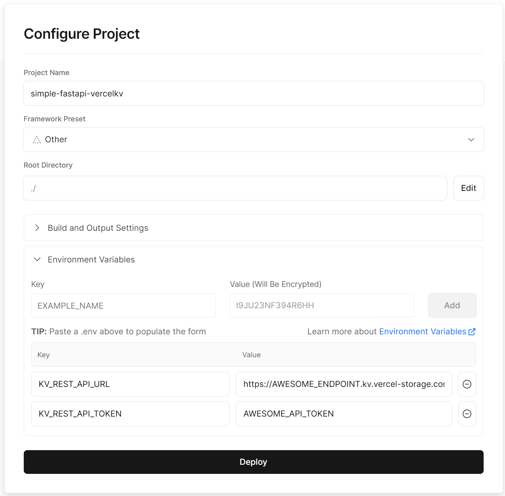

# Simple FastAPI with VercelKV Storage

Simple FastAPI with VercelKV Storage is a boilerplate for create fast api backend server with storage free by using Vercel

## Installation

### Local Test

To Connect your vercel KV Storage, need to set endpoint and api key variables on .env file

```bash
cp .env.sample .env
vim .env
```

### Vercel Depoly



1. Clone this repository and push.

2. In Vercel, Create -> Project -> select cloned repository

3. Input the Environment Variables. If you write env files above, just copy and paste.

4. Deploy!

## Usage

### Test the deploy.

```bash
curl --request GET \
  --url https://{your_vercel_project}.vercel.app/health
```

### Serving static files.

```bash
curl --request GET \
  --url https://{your_vercel_project}.vercel.app/public/simple-static-file.png
```

### Writing a post.

```bash
curl --request POST \
  --url https://{your_vercel_project}.vercel.app/posts/1 \
  --header 'Content-Type: application/json' \
  --data '{
	"title": "the first post",
	"content": "hello world",
	"writer": "Matt"
}'
```

### Retriving post.

```bash
curl --request GET \
  --url https://{your_vercel_project}.vercel.app/posts/1
```

# Contributing

Pull requests are welcome. For major changes, please open an issue first
to discuss what you would like to change.

Please make sure to update tests as appropriate.

# License

[MIT](https://choosealicense.com/licenses/mit/)
